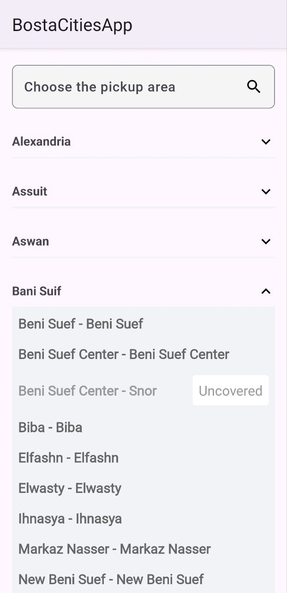

# Bosta Cities and Districts App

This is a single-screen Android app developed for the Bosta Android Developer Technical Assessment. The app fetches a list of cities and their corresponding districts from the provided API and displays them using `RecyclerView`.

## 🛠 Tech Stack

- Kotlin
- MVVM Architecture
- Retrofit 2
- Coroutines
- RecyclerView
- ViewModel

## 📦 Features

- Fetch cities and their districts from the Bosta API.
- Display data in a clean and scrollable UI.
- Handle loading and error states.
- Separation of concerns using MVVM.

## 🧪 Testing
- Unit tests included for ViewModel logic.
- Mock data used to verify functionality.


## 🔍 How to Run

1. Clone this repository:
   ```bash
   git clone https://github.com/Habiba-Abdeldayem/bosta-android-task

2. Open the project in Android Studio.

3. Build and run the app on an emulator or physical device.

## 📸 Screenshots

| Main Screen                                    |
|------------------------------------------------|
|  |
